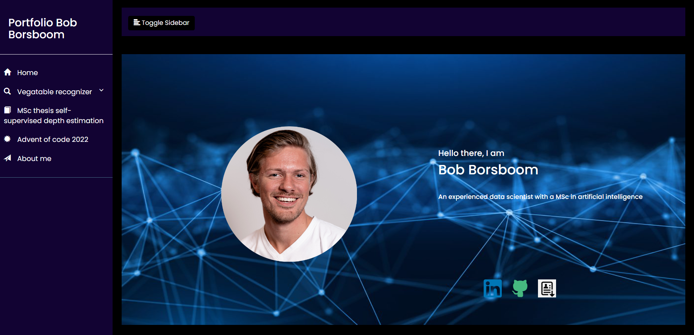

## Welcome

On this page you can read the steps on how to run the website, how to download the dataset and how to train your own model.


## Run the website

Prerequisites:

- python 3.7.7, download can be found <u> [here](https://www.python.org/downloads/release/python-377/) </u>
- anaconda


Create an empty environment
```
conda create --name <envname> python=3.7.7
```
Activate the environment
```
conda activate <envname>
```
In your prompt, navigate to the folder where you want to save the website, then download the website by:
```
Git clone https://github.com/boeboska/website.git
```
Install the required packages to run the website. (This might take +/- 20 minutes)
```
pip install -r requirements.txt
```
Run the website
```
python app.py
```
Click on the link in the prompt and the website will open. Enjoy!


## Download the dataset
The vegatable dataset can be found <u> [here](https://www.kaggle.com/datasets/misrakahmed/vegetable-image-dataset) </u>

Save the dataset in a folder named 'vegatable_data' if you want to use it for training

## Train your own model
Run python training_neural_network.py


The trained model and the training and validation accuracies and losses will be saved in the models folder with a time stamp.
Some hyperparameters which could be tuned:
<ul>
<li>Amount of epochs</li>
<li>Learning rate</li>
<li>Momentum rate</li>
</ul>